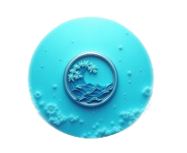
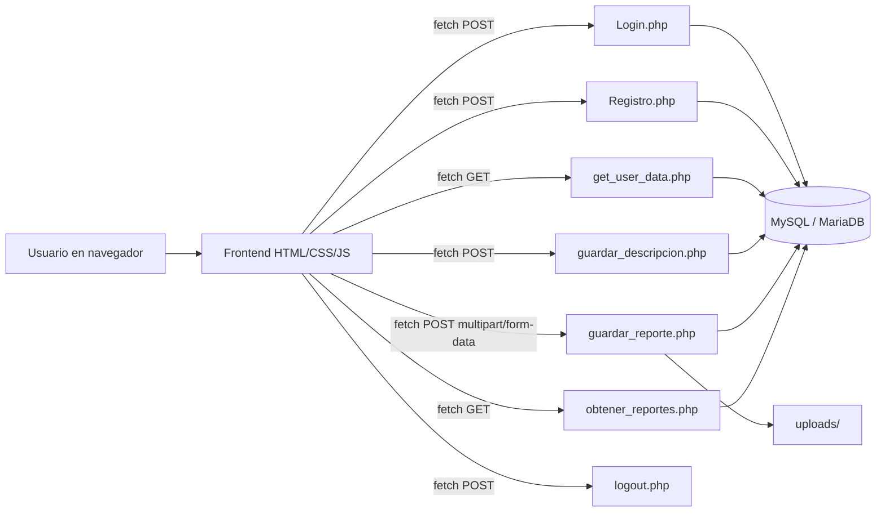

<p align="center">
	
</p>

<p align="center">
	<a href="https://git.io/typing-svg">
		
	</a>
</p>

<p align="center">
	
	
	
	
	
	
</p>

<p align="center">
	
</p>

---

## Descripcion del Proyecto

**OceanGoal** (tambien presentado como **OceanCare** en la interfaz) es una plataforma web enfocada en la **proteccion de ecosistemas marinos**.

El proyecto integra:

- Concientizacion ambiental mediante contenido y noticias marinas.
- Reportes ciudadanos sobre incidencias (contaminacion, avistamientos, etc.).
- Autenticacion de usuarios y gestion de perfil.
- Persistencia de datos en **MySQL/MariaDB** para la version 2.0.

---

## Versiones del Proyecto

| Version | Stack | Estado | Descripcion |
|---|---|---|---|
| **OceanGoal1.0** | HTML + CSS + JavaScript | Prototipo | Version inicial visual/funcional basica sin backend robusto. |
| **OceanGoal2.0** | PHP + MySQL + HTML/CSS/JS | Operativa | Version funcional con login, registro, sesiones, reportes y perfil. |

---

## Caracteristicas Principales

| Modulo | Funcionalidades |
|---|---|
| **Autenticacion** | Registro de usuarios, login con verificacion de hash, cierre de sesion |
| **Perfil** | Consulta de datos del usuario autenticado y actualizacion de descripcion personal |
| **Reportes** | Creacion de reportes con tipo, fecha, descripcion e imagen (max. 2.5MB) |
| **Mis Reportes** | Listado historico de reportes del usuario logueado |
| **Noticias Marinas** | Consumo de feed RSS (Google News) a traves de rss2json |
| **Navegacion Web** | Flujo entre Home, Noticias, Perfil y Reportes |

---

## Vista de Arquitectura



---

## Stack Tecnologico

<p align="center">
	
	
	
	
	
	
</p>

---

## Estructura del Repositorio

```text
OceanGoal/
|-- README.md
|-- OceanGoal1.0/
|   |-- index.html
|   |-- OceanGoal.html
|   |-- home.html
|   |-- register.html
|   |-- script.js
|   |-- home.css
|   `-- style.css
`-- OceanGoal2.0/
		|-- Login.html
		|-- Login.php
		|-- Registro.php
		|-- home.html
		|-- Noticias.html
		|-- reportes.html
		|-- mis_reportes.html
		|-- perfil.html
		|-- db_connection.php
		|-- guardar_reporte.php
		|-- obtener_reportes.php
		|-- get_user_data.php
		|-- guardar_descripcion.php
		|-- logout.php
		|-- ocean_goal (1).sql
		`-- uploads/
```

---

## Instalacion y Configuracion (OceanGoal2.0)

### Prerrequisitos

- PHP 8.2 o superior.
- MySQL/MariaDB.
- Apache (XAMPP, WAMP o Laragon).
- Navegador moderno.

### 1. Clonar el repositorio

```bash
git clone https://github.com/tu-usuario/OceanGoal.git
cd OceanGoal
```

### 2. Copiar al directorio del servidor

Ejemplo en XAMPP (Windows):

```bash
C:\xampp\htdocs\OceanGoal
```

### 3. Importar la base de datos

Importa el archivo:

```text
OceanGoal2.0/ocean_goal (1).sql
```

Puedes hacerlo con phpMyAdmin o por terminal:

```bash
mysql -u root -p ocean_goal < "OceanGoal2.0/ocean_goal (1).sql"
```

### 4. Configurar conexion a BD

Edita `OceanGoal2.0/db_connection.php` si tu entorno no usa `root` sin clave:

```php
$host = 'localhost';
$user = 'root';
$password = '';
$database = 'ocean_goal';
```

### 5. Levantar servicios

- Inicia **Apache** y **MySQL/MariaDB**.

### 6. Ejecutar la app

Abrir en navegador:

```text
http://localhost/OceanGoal/OceanGoal2.0/Login.html
```

---

## Endpoints Backend (PHP)

| Endpoint | Metodo | Funcion |
|---|---|---|
| `Login.php` | POST | Autentica usuario y crea sesion |
| `Registro.php` | POST | Registra usuario con `password_hash` |
| `get_user_data.php` | GET | Devuelve datos del perfil del usuario autenticado |
| `guardar_descripcion.php` | POST | Guarda descripcion del perfil |
| `guardar_reporte.php` | POST | Guarda reporte y sube imagen a `uploads/` |
| `obtener_reportes.php` | GET | Lista reportes del usuario logueado |
| `logout.php` | POST | Cierra sesion |

---

## Flujo de Uso

1. Crear cuenta desde `Login.html`.
2. Iniciar sesion.
3. Acceder a `home.html`.
4. Crear reportes en `reportes.html`.
5. Consultar historial en `mis_reportes.html`.
6. Editar descripcion en `perfil.html`.
7. Cerrar sesion desde perfil.

---

## Base de Datos (Resumen)

Tablas principales:

- **users**: `id`, `username`, `password_hash`, `created_at`, `descripcion`.
- **reportes**: `id`, `usuario`, `tipo`, `fecha`, `descripcion`, `imagen_url`.

---

## Seguridad y Consideraciones

Implementado actualmente:

- Uso de `password_hash()` y `password_verify()`.
- Sesiones con `$_SESSION` para autenticacion.
- Restriccion de extensiones y tamano de imagenes en reportes.

Mejoras recomendadas para produccion:

- Validacion de MIME type del archivo subido.
- Tokens CSRF en formularios sensibles.
- Manejo centralizado de errores y logging.
- HTTPS obligatorio.
- Politicas de permisos para `uploads/`.

---

## Problemas Comunes

### Error de conexion a base de datos

- Revisa credenciales en `db_connection.php`.
- Confirma que la BD `ocean_goal` exista e incluya tablas.

### Imagen no sube

- Verifica limite de 2.5MB.
- Revisa permisos de escritura en `uploads/`.

### No puedo iniciar sesion

- Confirma que el usuario existe en `users`.
- Si importaste SQL, crea una cuenta nueva desde el formulario si lo necesitas.

---

## Roadmap

- [x] Login y registro con base de datos.
- [x] Perfil de usuario con descripcion.
- [x] Reportes con imagen.
- [x] Listado de reportes del usuario.
- [ ] Dashboard con estadisticas de reportes.
- [ ] Moderacion/administracion de reportes.
- [ ] Integracion de mapas para geolocalizar incidencias.
- [ ] API REST versionada.

---

## Contribucion

1. Haz un fork del repositorio.
2. Crea tu rama de trabajo.
3. Implementa y prueba tus cambios.
4. Abre un Pull Request con descripcion clara.

```bash
git checkout -b feature/nueva-funcionalidad
git commit -m "feat: agrega nueva funcionalidad"
git push origin feature/nueva-funcionalidad
```

---

## Licencia

Actualmente este repositorio **no define una licencia explicita**.
Si deseas uso abierto, agrega un archivo `LICENSE` (por ejemplo MIT).

---

## Autor

**S0ntyrr**

- GitHub: https://github.com/S0ntyrr

---

<p align="center">
	
</p>

<p align="center">
	Si este proyecto te aporta valor, considera darle una estrella.
</p>
